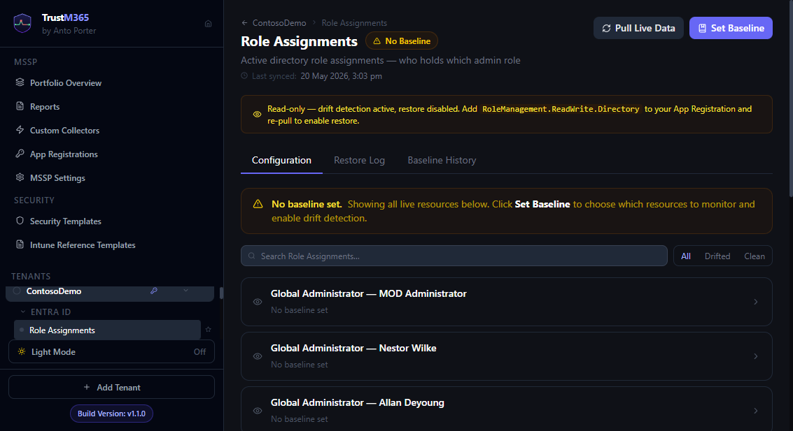

# Guide 03 — Understanding drift detection



_Visual reference: where drift states and resource-level differences surface._

---

## How drift is detected

Every time TrustM365 syncs an area, it:

1. Pulls the current live configuration from Microsoft Graph
2. Compares it against the saved baseline
3. Records the result in the database with a timestamp

The comparison works differently depending on the monitoring mode:

**Properties mode:** Each watched field is compared individually. If the live value differs from the baseline value for any watched field, that field is flagged as drifted.

**Snapshot mode:** A SHA-256 hash of the resource (excluding volatile metadata fields) is compared against the hash stored in the baseline. If the hash differs, the resource is flagged as drifted.

---

## Drift states

| State | Colour | Meaning |
|---|---|---|
| **Clean** | 🟢 Green | All monitored fields/hash match the baseline |
| **Drifted** | 🔴 Red | One or more fields differ from baseline |
| **Missing** | 🟠 Orange | Resource exists in the baseline but cannot be found in the tenant |
| **No Baseline** | 🟡 Yellow | No baseline has been set — no comparison is possible |
| **Unavailable** | Grey | The area cannot be monitored on this tenant (no licence, or permission not granted) |

---

## Where drift surfaces

Drift is visible at four levels, from broadest to most specific:

### 1. Sidebar

Each area in the sidebar shows a coloured dot:
- 🟢 Green — clean
- 🔴 Red — drifted
- Grey — no data

The tenant entry shows a red badge with the count of drifted areas.

### 2. Dashboard — Baseline Status strip

The strip below the tenant overview tiles shows counts across all areas for that tenant:
- **Drifted** — areas with genuine drift
- **Clean** — areas matching baseline
- **No Baseline** — areas with no baseline set
- **Unchecked** — baselined areas not yet synced

### 3. Dashboard — Area card

Each area card shows its individual status and, when drifted, the drift count (number of affected resources or property changes).

### 4. Area View — Configuration tab

The full property-level diff. Drifted resources appear expanded at the top with a side-by-side comparison:

```
displayName
  Baseline:   "MFA Required — All Users"
  Live:       "MFA Required - All Users"        [Fix]
```

Each drifted property has a **Fix** button for per-property restore.

---

## What triggers a sync

A sync can be triggered three ways:

1. **Manual:** Click **Sync All** on the dashboard, or **Pull Live Data** inside an Area View
2. **Scheduled:** If automatic drift checks are enabled for the tenant (⚙ Settings on the dashboard), TrustM365 runs a sync on the configured interval

---

## How often to sync

| Scenario | Recommended interval |
|---|---|
| Production tenant — security-critical | 15–30 minutes |
| Production tenant — standard monitoring | 1–2 hours |
| Dev/test tenant | 4–12 hours |
| Infrequently-changing areas (e.g. CA policies) | 1–6 hours is sufficient |

Very short intervals (< 5 minutes) are allowed but increase Graph API call volume. Microsoft Graph throttles at roughly 10,000 requests per 10 minutes per app registration — TrustM365 will not exceed this for normal deployments.

---

## The effective status rule

After auto-restore runs, the database may briefly contain a row with `status = 'drifted'` and `drift_count = 0`. This happens because the sync detects drift, triggers an auto-restore, and then records a "re-check" result — all within the same sync cycle.

TrustM365 applies the effective status rule throughout the UI: **drifted + drift_count=0 is treated as clean**. You will never see a red indicator for a resource that has no outstanding drift items.

---

## False positives and how to avoid them

**Problem:** An area drifts every sync even though the configuration is correct.

**Causes and fixes:**

| Cause | Fix |
|---|---|
| Watching a frequently-updated field (e.g. `lastSignInDateTime`) | Remove that field from the watched properties |
| Snapshot mode on a dynamic resource | Switch to Properties mode and select only stable fields |
| Intentional change not reflected in baseline | Click Edit Baseline → update the baseline to match the new intended state → save |
| New resource added to tenant not in baseline | Click Edit Baseline → include the new resource → save |

**Problem:** Drift is not detected when a known change was made.

**Causes and fixes:**

| Cause | Fix |
|---|---|
| The changed field is not in the watched properties | Edit Baseline → tick the field → save → re-sync |
| The changed resource is not included in the baseline | Edit Baseline → include the resource → save → re-sync |
| Auto-restore reverted the change before you saw it | Check the Restore Log tab for recent auto-restore activity |

---

## Drift deduplication in reports

When generating a report, TrustM365 counts drift *events* rather than drift *rows*. If the same area drifted across multiple syncs (because it was detected, then the sync ran again before it was remediated), it still counts as one event. This prevents inflated event counts in client-facing reports.
