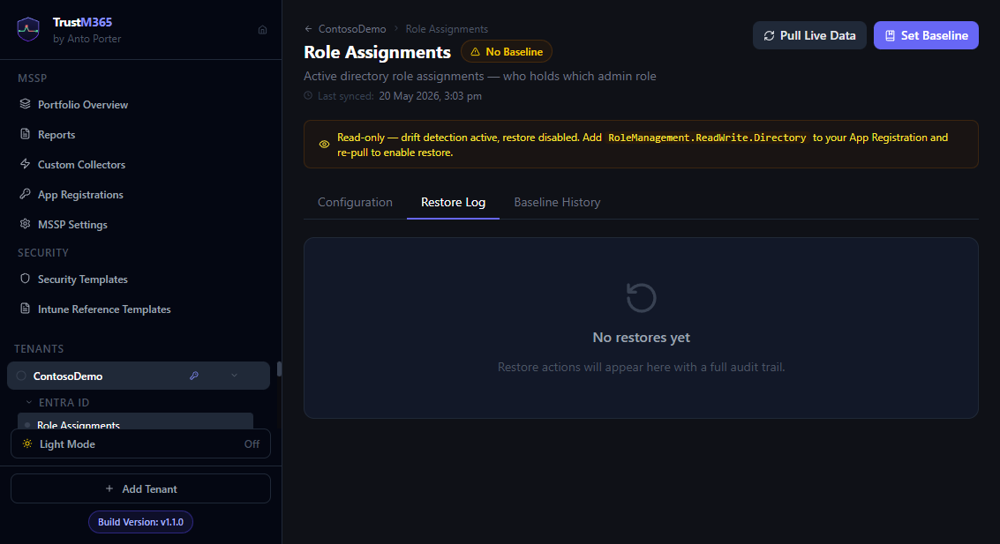

# Guide 04 — Restoring to baseline

> **Write permissions required.** Restore pushes changes to Microsoft 365 via the Graph API. The App Registration must have the corresponding `ReadWrite` permissions granted. Read-only deployments will not show restore buttons.



_Visual reference: restore workflow context and restore-log tab in Area View._

---

## Restore options

| Action | How | Best for |
|---|---|---|
| Restore a single property | **Fix** button next to a drifted property row | Surgical fix — only one field changed |
| Restore a full resource | **Restore** button on a resource card | Multiple properties drifted on the same resource |
| Restore all drifted resources | **Restore All (N)** in the area header | Fast remediation across an entire area |
| Auto-restore on sync | Toggle **Auto-Restore** in area settings | Unattended enforcement of baseline values |
| Dry-run preview | Append `?dryRun=true` to the restore API call | Verify what will be patched before committing |

---

## Restoring a single property

Navigate to the Area View → Configuration tab.

Drifted resources appear at the top of the list, expanded. Each drifted property shows:

```
displayName
  Baseline:   "MFA Required — All Users"         ← the value TrustM365 will restore
  Live:       "MFA Required - All Users"          ← current value in M365
                                            [Fix]
```

Click **Fix** to send a PATCH to Graph restoring only that property to its baseline value.

The property row updates immediately to show the restored value. The overall resource status updates after TrustM365 re-pulls the area.

---

## Restoring a full resource

In the Configuration tab, each resource card has a **Restore** button in its header (only shown when the resource is drifted).

Clicking **Restore** sends a PATCH to Graph with all writable baseline fields for that resource.

Read-only fields (`id`, `createdDateTime`, `lastModifiedDateTime`, `@odata.type`, etc.) are automatically stripped from the PATCH body — they are never sent.

---

## Restoring all drifted resources

Click **Restore All (N)** in the Area View header, where N is the number of drifted resources.

TrustM365 processes each drifted resource in sequence. A progress indicator shows results as they complete. Failed restores are reported inline without stopping the remaining items.

---

## Auto-restore

When auto-restore is enabled for an area, drift detected during any sync is automatically reverted before the sync job completes.

### Enabling auto-restore

1. Navigate to the Area View
2. Click the **Auto-Restore** toggle at the top of the Configuration tab

Or use the Auto-Restore panel on the tenant dashboard:
1. Click the **Auto-Restore** button in the dashboard header
2. Toggle individual areas on or off
3. Use **Enable All** or **Disable All** to bulk-apply

### How it works

1. Sync pulls live data
2. Drift is computed
3. If drift is detected and auto-restore is enabled: each drifted resource is immediately restored
4. A post-restore re-pull confirms the fix and records a clean result
5. The dashboard updates to Clean — no manual action needed

### Auto-restore notices

When auto-restore runs successfully, a dismissable banner appears on the dashboard:

```
✅ Auto-restore ran for User Accounts — 2 resources restored (1 manual restore also succeeded)
```

Banners auto-dismiss after 30 seconds.

### When to use auto-restore

**Good use cases:**
- Enforcing non-negotiable security policies (e.g. a CA policy that must always be enabled)
- Reverting accidental changes by operators who have write access to M365
- Unattended tenants where you want guaranteed configuration enforcement

**When to be cautious:**
- Do not enable auto-restore if operators may make intentional changes — it will immediately revert them
- Always update the baseline before enabling auto-restore for a newly-changed configuration
- Endpoint Security areas (Firewall, Antivirus, ASR) — test auto-restore on a non-production tenant before enabling on production

---

## Dry-run preview

Before executing a restore, you can preview exactly what Graph PATCH would be sent.

This is available via the API:

```http
POST /api/areas/{tenantId}/{areaKey}/restore?dryRun=true
Content-Type: application/json

{
  "resourceId": "the-resource-id",
  "propertyPath": "state"    ← omit for full resource restore
}
```

Response:

```json
{
  "dryRun": true,
  "resourceName": "MFA Required — All Users",
  "patchUrl": "/api/areas/.../restore",
  "patchBody": { "state": "enabled" },
  "baselineValues": { "state": "enabled" },
  "liveValues": { "state": "disabled" }
}
```

The dry-run call makes no changes to Microsoft 365. Use it to verify your understanding of what will be changed before a production restore.

---

## Restore log

The **Log** tab in every Area View shows the full restore history for that area.

Each entry shows:

| Column | Value |
|---|---|
| Status | ✅ OK or ❌ FAIL |
| Type | Property / Full restore / Bulk restore / Auto-restore |
| Resource | Display name of the resource |
| Properties | Every field that was patched |
| Timestamp | When the restore ran |
| Error | Shown when a restore fails — includes the exact Graph API error message |

The log is append-only. Old entries are never deleted automatically.

---

## What restore cannot do

| Limitation | Reason |
|---|---|
| Cannot restore resources that were permanently deleted | Graph cannot recreate deleted objects |
| Cannot restore App Protection Policies (MAM) — property or full | MAM policies involve complex app targeting arrays; correct manually in the Intune portal: Apps → App protection policies → select the policy |
| Cannot restore Custom Collector areas | All custom collectors are read-only by design |
| Cannot restore a resource not in your baseline | Only resources included in the baseline have baseline values to restore to |
| EP Security — `settings`, `settingCount`, `assignments` are monitor-only | These fields cannot be individually property-restored. Use the full resource restore button, which applies the two-step settings restore via the Graph beta endpoint |
| EP Security — individual settings restore requires live Graph ID lookup | Settings IDs stored in older baselines may be sequential indices rather than GUIDs. Full resource restore resolves IDs from Graph at restore time; any unresolvable settings show a portal redirect message |
| Configuration Profiles — `settings` and `version` are monitor-only | `settings` is a flat stored bag, not a PATCH-able API field; `version` is read-only. Use full resource restore |
| CA Policies — nested paths (`conditions.*`, `grantControls.*`, `sessionControls`) cannot be property-restored | Graph requires the full parent object in the PATCH body. Use full resource restore, which sends the complete CA policy body |

---

## Permissions required per area

| Area | Required permission |
|---|---|
| User Accounts | `User.ReadWrite.All` |
| Groups | `Group.ReadWrite.All` |
| App Registrations | `Application.ReadWrite.All` |
| Conditional Access | `Policy.ReadWrite.ConditionalAccess` |
| Authentication Policies | `Policy.ReadWrite.AuthenticationMethod` |
| Role Assignments | `RoleManagement.ReadWrite.Directory` |
| Intune Compliance, Config, Update Rings, MTD | `DeviceManagementConfiguration.ReadWrite.All` |
| Endpoint Security (AV, Firewall, BitLocker, ASR) | `DeviceManagementConfiguration.ReadWrite.All` |
| SharePoint Sites | `Sites.Manage.All` |
| Teams | `TeamSettings.ReadWrite.All` |

If a restore returns `403 Permission denied`, the App Registration is missing the relevant `ReadWrite` permission. Add it in Entra ID, grant admin consent, and re-sync.
