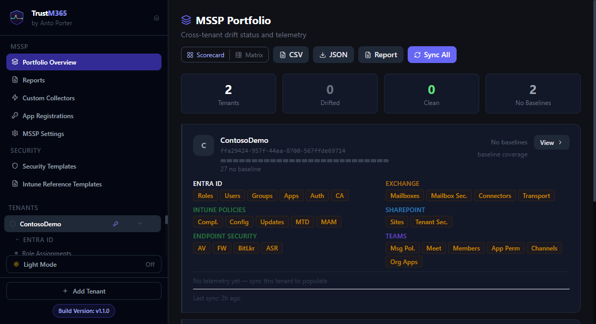

# Guide 09 — Portfolio Overview

Navigate to **Portfolio Overview** in the MSSP section of the sidebar. This page shows all registered tenants at a glance with cross-tenant drift visibility.

_Visual reference: summary tiles, tenant coverage/status cards, and top-level filters._

---

## Summary strip

Four tiles at the top of the page:

| Tile | Meaning |
|---|---|
| **Tenants** | Total number of registered tenants |
| **Drifted** | Tenants with at least one genuinely drifted baselined area |
| **Clean** | Tenants where all baselined areas are clean |
| **No Baselines** | Tenants with no baselines set anywhere |

> "Clean" means all *baselined* areas pass — unmonitored areas (no baseline set) are neutral and do not affect this count.

---

## Views

Toggle between **Scorecard** and **Matrix** using the buttons in the top-right.

---

## Scorecard view

Each tenant is shown as a card with a left-border colour:

| Border colour | Status |
|---|---|
| 🟢 Green | All baselined areas clean |
| 🔴 Red | One or more baselined areas drifted |
| 🟡 Yellow | Some areas monitored, some not — partial coverage |
| Grey | No baselines set |

**Coverage bar** — a segmented progress bar showing each area's status at a glance (green=clean, red=drifted, yellow=baselined but unchecked, grey=no baseline).

**Coverage percentage** — shown top-right of each card. 100% means every area that has a baseline is currently clean.

**Area pills** — grouped into four rows:

| Row | Areas |
|---|---|
| Entra ID | Roles, Users, Groups, Apps, Auth, CA |
| Intune Policies | Compl., Config, Updates, MTD, MAM |
| Endpoint Security | AV, FW, BitLkr, ASR |
| Device Telemetry | WinDef |

Each pill is colour-coded (green=clean, red=drifted with count, yellow=no baseline, grey=no data). Hover any pill for its full name.

**Drift pills** — when a tenant has drift, clickable red pills appear at the bottom of the card identifying the specific areas. Click any pill to jump directly to that area's view.

---

## Matrix view

A compact table with one row per tenant and one column per area.

| Cell | Meaning |
|---|---|
| ✓ (green) | Clean |
| N (red, number) | Drifted — click to navigate to that area |
| — (yellow) | No baseline |
| · (grey) | Not yet synced |

Columns are grouped with coloured headers:
- **Microsoft Entra ID** — indigo
- **Intune — Policies** — emerald
- **Endpoint Security** — orange
- **Telemetry** — sky blue

A colour legend appears at the bottom of the matrix.

---

## Filtering and sorting

Above the tenant cards:

- **Search input** — filter by tenant name, ID, or tag
- **Status pills** — filter by Drifted / Clean / Partial / Unconfigured
- **Tag pills** — filter by any tenant tags you have set
- **Sort** — Most drifted first / A→Z / Z→A / Recently synced
- **Clear** — removes all active filters

Preferences are saved in your browser.

---

## Actions

| Button | Action |
|---|---|
| **CSV** | Download a full cross-tenant drift report as CSV |
| **JSON** | Download the raw portfolio data as JSON |
| **Report** | Generate a tenant report for the selected tenant |
| **Sync All** | Sync all areas for all tenants in parallel |

---

## Bulk sync

Click **Sync All** to kick off a parallel sync across all tenants. A progress bar appears showing `X / Y tenants` complete. Failed tenants are reported at the end without stopping the others.

The "Bulk sync complete — X/X tenants synced" toast appears when finished.
