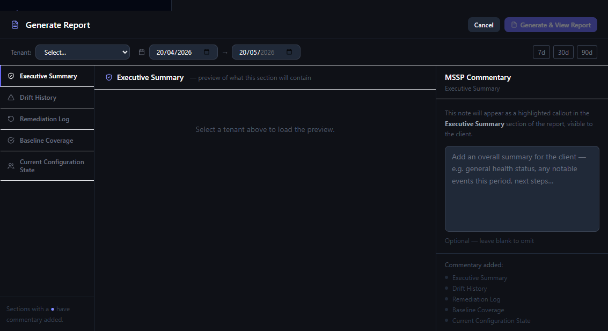

# Guide 11 — Report scheduling

TrustM365 can generate reports automatically on a weekly or monthly cadence, storing them in the Reports list with an unread indicator.

_Visual reference: report flow entry point and modal context for scheduling/report operations._

---

## Configuring a schedule

Navigate to **Reports** → find the **Schedule** section (or access it from a tenant's report settings panel).

| Setting | Options |
|---|---|
| **Frequency** | Weekly or Monthly |
| **Day (weekly)** | Monday–Sunday |
| **Day of month (monthly)** | 1–28 (28 max to avoid month-length issues) |
| **Enabled** | On/Off toggle |

---

## How scheduling works

A background cron job runs every day at **08:00 server time**. It checks all active schedules and generates any reports that are due.

- **Weekly:** Report generates on the configured day of the week
- **Monthly:** Report generates on the configured day of the month

Generated reports are stored with `trigger = 'scheduled'` and `unread = 1`.

---

## Unread badges

The **Reports** item in the sidebar shows a badge with the count of unread reports. Reports generated by the scheduler are always marked unread initially. Opening a report marks it as read.

---

## What scheduled reports contain

Scheduled reports cover the **previous 30 days** from the generation date by default. They include all the same sections as manually generated reports, with no MSSP commentary (since they are unattended). You can add commentary by opening the report and re-generating manually if needed.

---

## Stopping or pausing a schedule

Toggle the **Enabled** switch to pause a schedule without deleting the configuration. The next scheduled run date is shown below the toggle.

---

---

**Timezone note:**
All scheduled and generated report timestamps use the server's local time (or UTC if not otherwise configured at the OS/container level). The timezone is not configurable in the UI. If you need to change the timezone, set the `TZ` environment variable at the server or container level.

---
