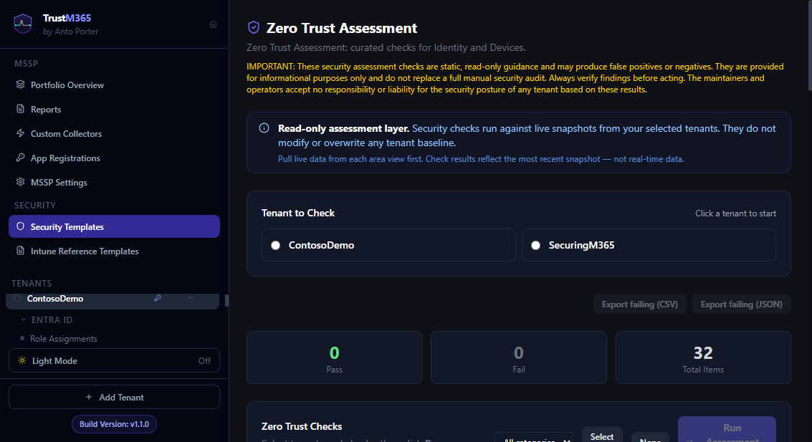

# Guide 14 — Security Templates (Security Checks)

Navigate to **Reference Sets** (Security Templates) in the MSSP sidebar.

Reference Sets are curated, read-only security guidance (Zero Trust Assessment V2 and upstream sources) represented as JSON reference templates in the backend (`backend/data/reference-templates`). The Security Templates UI surfaces these Reference Sets so you can evaluate a tenant's configuration against the guidance without creating or modifying baselines.

_Visual reference: tenant selection, check selection, and assessment summary view._

---

> **Note:** As of v1.1, Security Templates support only single-tenant selection. Multi-tenant selection is no longer available.

---

## Running reference checks

1. Select a tenant in the tenant selection panel.
2. Choose an owner or leave the owner set to **All** to include available owner sets in the view.
3. Click **Run Reference Checks** to evaluate selected Reference Sets against the chosen tenant.

Results are returned for the selected tenant. Use **View details** on any Reference Set to see a per-template breakdown and sample matched resources.

Notes:
- The UI excludes `openintune` templates from the Security Templates view; upstream and community owners are merged into the Security Templates listing for convenience.
- Use **Reload sets** to refresh templates from disk (this calls the backend reload endpoint).
- The owner summary cards at the top show counts for the tenant you selected. Hover the info icon for a brief explanation.
- Use the **Export failing (CSV)** and **Export failing (JSON)** options to download failing reference items for review or reporting. Exports use current results from **Run Reference Checks** or the aggregated owner summary and do not trigger live checks.
- Totals and fallback behaviour: the three owner-summary counters (Matched, Not matched, Total Items) are for the selected tenant. If an explicit owner summary is not available, the UI will compute totals from per-template aggregates; if those are also unavailable it falls back to the most recent results returned by **Run Reference Checks**. Exports use the same source of results and do not trigger live scans.

---

## Check groups

| Group | Checks |
|---|---|
| **Multi-Factor Authentication** | MFA enforced for all users · MFA enforced for admins · Legacy authentication blocked |
| **Authentication Methods** | SMS authentication disabled · Voice call disabled · Phishing-resistant method available |
| **Guest & External Access** | Guest invitations restricted to admins · MFA required for B2B guests |
| **Admin Account Protection** | Compliant device required for admin roles · Global Admin count within recommended limit |
| **Conditional Access Hygiene** | No policies permanently in report-only mode · No permanently disabled policies |

---

## Result states

| State | Meaning |
|---|---|
| ✅ **Pass** | The check condition is met |
| ❌ **Fail** | The check condition is not met — review recommended |
| ⚠ **Unavailable** | The required data or permission is not available (e.g. CA policies require Entra P1/P2) |

---

## Check identifiers

Each check references its upstream guidance identifier (when available) in the result detail. Use these to trace back to the source guidance when discussing findings with clients.

---

## What these checks are not

Reference Set checks are **not** baseline monitoring. They do not:

- Create or modify baselines
- Detect drift from a saved configuration
- Trigger automated remediation or restores

They answer: "Does this tenant currently meet these recommendations?" For drift monitoring use baselines (see [Guide 02](02-configuring-a-baseline.md)).

---

## Best Practices

- Regularly run checks to ensure tenant configurations align with security standards.
- Use aggregated results to identify trends and common issues across tenants.
- Export results for detailed analysis and client reporting.

---

## Related Guides

- [20 — Reference Templates](20-reference-templates.md)
- [16 — Intune Endpoint Security](16-intune-endpoint-security.md)
