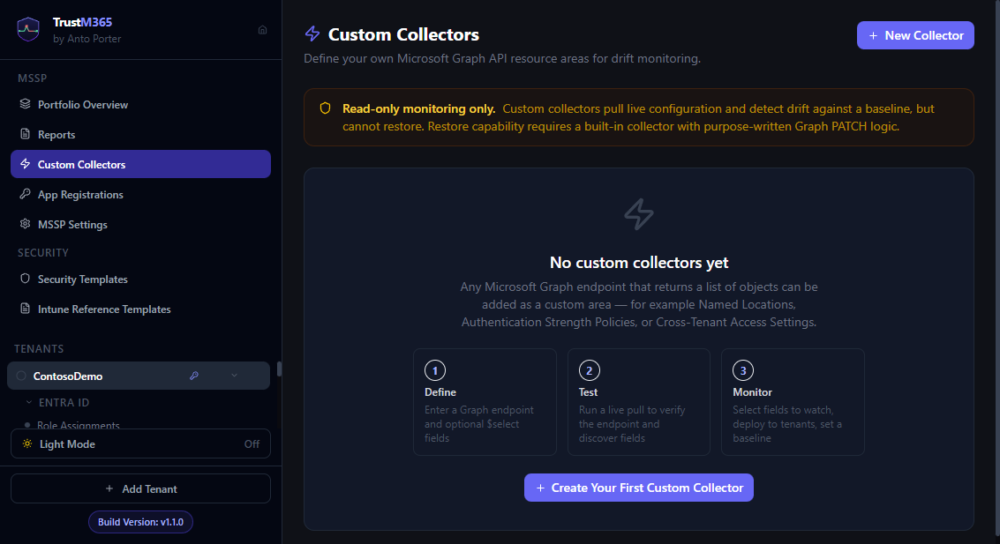

# Guide 15 — Custom Collectors

Navigate to **Custom Collectors** in the MSSP sidebar section.

_Visual reference: collector onboarding screen and entry point for creating a new collector._

Custom Collectors let you monitor any Microsoft Graph endpoint as a resource area, without writing code. Pull, baseline, and detect drift on any configuration that Graph exposes — named locations, authentication strength policies, cross-tenant access settings, and more.

> Custom collectors are always **read-only**. Restore is never available for user-defined areas.

---

## Step 1 — Define the collector

Click **+ New Custom Collector**.

| Field | Description |
|---|---|
| **Display Name** | The name shown in the dashboard, sidebar, and reports |
| **Description** | Optional — appears below the area name in the dashboard |
| **Graph endpoint path** | The path after `https://graph.microsoft.com/v1.0`, e.g. `/identity/conditionalAccess/namedLocations` |
| **$select fields** | Optional — comma-separated list of fields to pull (leave blank for all fields) |

**Advanced options** (expand to reveal):

| Field | Description | Default |
|---|---|---|
| **ID field** | Which field to use as the unique resource ID | `id` |
| **Name field** | Which field to use as the human-readable resource name | `displayName` |

Use [Graph Explorer](https://developer.microsoft.com/en-us/graph/graph-explorer) to find and test endpoints. Sign in with an account that has the same permissions as your App Registration to verify the response.

---

## Step 2 — Test the pull

Choose a tenant and click **Run Test Pull**.

TrustM365 calls the endpoint live using the tenant's App Registration credentials. Results show:

- ✅ Success — resource count and a collapsible sample of the first resource's JSON
- ❌ Error — the exact error (403 = missing permission, 404 = endpoint not found, etc.)

Inspect the sample JSON to verify the `id` and `displayName` fields are present, or adjust the advanced options if they use different field names.

---

## Step 3 — Configure watchable fields

All fields discovered from the live response are listed. Tick the fields you want to monitor for drift.

- Field types are auto-detected (boolean, number, array, json, string)
- Labels are editable inline — change them to something more readable before saving
- You can come back and edit the field list at any time

Click **Save Collector**.

---

## Deploying to tenants

New collectors are **inactive on all tenants by default**.

Expand the collector card and toggle each tenant individually. Only enabled tenants will show the area in their dashboard and sync it.

> Toggling a tenant off removes the area from that tenant's dashboard and deletes all associated baselines and drift history for that tenant. The collector definition and other tenants are unaffected.

---

## Using a custom collector

Once deployed to a tenant, the custom area behaves exactly like a built-in area:

1. Pull live data via the dashboard or Area View
2. Set a baseline in the Baseline Editor
3. Drift is detected on every subsequent sync

The only difference is that restore is never available.

---

## Finding the right Graph endpoint

Common useful endpoints for custom collectors:

| Area | Endpoint |
|---|---|
| Named Locations | `/identity/conditionalAccess/namedLocations` |
| Authentication Strengths | `/policies/authenticationStrengthPolicies` |
| Cross-tenant Access | `/policies/crossTenantAccessPolicy/partners` |
| Privileged Identity Management roles | `/privilegedAccess/aadGroups/resources` |
| Domain configurations | `/domains` |
| Directory settings | `/settings` |
| Admin consent workflow | `/policies/adminConsentRequestPolicy` |

> Endpoints under `/beta` work but note that beta endpoints are subject to change. Use v1.0 endpoints where available for production monitoring.

---

## Permissions

Custom collectors inherit the permissions already granted to the App Registration. If the endpoint you choose requires an additional permission:

1. Add the permission in Entra ID → App registrations → API permissions
2. Click **Grant admin consent**
3. In TrustM365, click the **Re-check permissions** button on the tenant or re-sync — the area will unlock automatically

The test pull will return a clear `403 Permission denied` if the required permission is missing.

Note: Custom collectors targeting SharePoint or Teams endpoints may require the specific permissions listed in the prerequisites guide (`Sites.Read.All`, `Team.ReadBasic.All` for monitoring) and their corresponding write permissions for restore (`Sites.Manage.All`, `TeamSettings.ReadWrite.All`). These Graph endpoints can also be subject to throttling and specialised query patterns (pagination, `$select`, consistencyLevel), so prefer narrow `$select` fields and validate in Graph Explorer before saving a collector.

---

## Deleting a custom collector

Click **Delete** on the collector card. This removes the collector definition and its data from **all tenants**. This cannot be undone.
