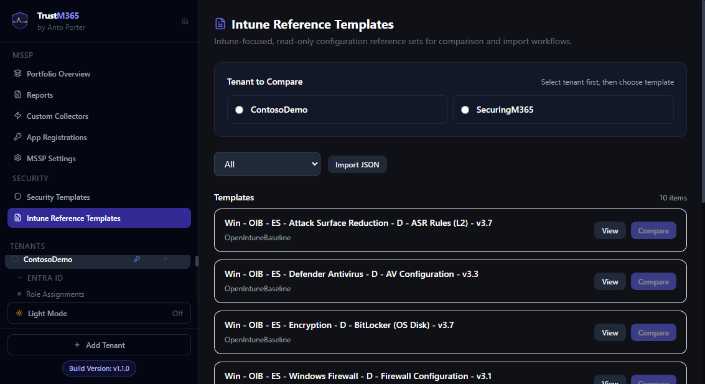

# Guide 16 — Intune endpoint security areas

TrustM365 monitors nine Microsoft Intune areas across two API tiers. Five use the Graph v1.0 API and four use the Graph beta API (Endpoint Security Settings Catalog policy types).

_Visual reference: Intune-focused templates and comparison workflow context._

---

## Area overview

| Area | API | Restorable | Notes |
|---|---|---|---|
| Compliance Policies | v1.0 | ✅ | Device compliance rules — encryption, password, OS version |
| Configuration Profiles | v1.0 | ✅ | Device configuration settings for managed devices |
| Windows Update Rings | v1.0 | ✅ | Feature/quality update deferral and deadline settings |
| Mobile Threat Defense | v1.0 | ✅ | Defender for Endpoint and partner connector states |
| App Protection Policies | v1.0 | ❌ Monitor only | MAM policies — iOS/Android data transfer restrictions |
| Endpoint Security — Antivirus | Beta | ✅ | Defender real-time protection, cloud protection, tamper protection |
| Endpoint Security — Firewall | Beta | ✅ | Domain/private/public firewall profile states |
| Endpoint Security — Disk Encryption | Beta | ✅ | BitLocker policies — encryption method, recovery key escrow |
| Endpoint Security — ASR | Beta | ✅ | Attack Surface Reduction rules |

---

## Permissions required

| Permission | Required for |
|---|---|
| `DeviceManagementConfiguration.Read.All` | All monitoring (compliance, config, update rings, endpoint security) |
| `DeviceManagementConfiguration.ReadWrite.All` | Restore for compliance, config profiles, update rings, endpoint security |
| `DeviceManagementServiceConfig.Read.All` | Mobile Threat Defense connector monitoring |
| `DeviceManagementServiceConfig.ReadWrite.All` | Mobile Threat Defense connector restore |
| `DeviceManagementApps.Read.All` | App Protection Policy monitoring |

> **After granting new permissions:** Click **⚙ → Sync Permissions** on the tenant dashboard to re-check from Graph immediately. The area will unlock on the next sync.

---

## Compliance Policies

**What it monitors:** Device compliance rules including password requirements, encryption, OS version minimums, and threat protection levels.

**Key watchable properties:**
- `passwordRequired`, `passwordMinimumLength`, `passwordRequiredType`
- `bitLockerEnabled`, `storageRequireEncryption`, `secureBootEnabled`
- `osMinimumVersion`, `osMaximumVersion`
- `activeFirewallRequired`, `defenderEnabled`

**Monitor-only fields:** `deviceThreatProtectionEnabled` and `deviceThreatProtectionRequiredSecurityLevel` are monitored for drift but cannot be restored via Graph — they require Defender for Endpoint licensing and must be corrected manually in the Intune portal.

**Restore:** Full PATCH to `/deviceManagement/deviceCompliancePolicies/{id}`.

---

## Configuration Profiles

**What it monitors:** Device configuration settings (legacy `deviceConfigurations` endpoint) — the full platform-specific settings object for each profile.

**Recommended monitoring mode:** Snapshot — hashes the entire settings payload. Any change to any field triggers drift.

**Restore:** PATCH spreads the baseline settings back as top-level properties on the `/deviceManagement/deviceConfigurations/{id}` endpoint. Read-only metadata fields are stripped automatically.

---

## Windows Update Rings

**What it monitors:** Update deferral days, deadline days, grace period, automatic update mode, and pause state for quality and feature updates.

**Key drift signals:**
- `qualityUpdatesDeferralPeriodInDays` — if this increases, security patches are being delayed
- `qualityUpdatesPaused` — if `true`, all quality updates are blocked
- `featureUpdatesPaused` — if `true`, feature updates are blocked

**Restore:** PATCH to `/deviceManagement/deviceConfigurations/{id}`.

**Note:** `assignments` (which groups a ring applies to) is captured but monitor-only — TrustM365 alerts when the assignment changes but does not restore it.

---

## Mobile Threat Defense Connectors

**What it monitors:** Partner connector states for Defender for Endpoint and any third-party MTD solutions.

**Required permissions:** `DeviceManagementServiceConfig.Read.All` (monitoring) and `DeviceManagementServiceConfig.ReadWrite.All` (restore). These are separate from the main `DeviceManagementConfiguration` permissions.

**Key drift signals:**
- `androidEnabled`, `iosEnabled`, `windowsEnabled` — if any flip to `false`, the MTD integration is disabled for that platform
- `partnerState` — `unresponsive` or `error` (monitor-only, not restorable)

**Restore:** PATCH to `/deviceManagement/mobileThreatDefenseConnectors/{id}`.

> If this area shows as Locked after adding the permission, click **⚙ → Sync Permissions** on the tenant dashboard to refresh the permission cache from Graph.

---

## Endpoint Security — Antivirus (Beta)

**What it monitors:** Full settings catalog payload for Defender Antivirus policies — real-time protection, cloud-delivered protection, tamper protection, PUA blocking, network protection.

**Monitoring mode:** Snapshot or Properties → watch the `settings` array. The entire settings catalog is stored as a JSON array of `settingInstance` objects. Any change to any setting surfaces as drift.

**Restore:** Two-step process. First, PATCH the policy metadata (name/description only — `settings` is a navigation property and cannot appear in the root PATCH body). Second, fetch the live settings from Graph (`GET /configurationPolicies/{id}/settings`) to resolve current setting IDs by `settingDefinitionId`, then PATCH each setting individually via `/configurationPolicies/{id}/settings/{settingId}`. Settings with no resolvable live ID are reported with a portal redirect message. Property-level restore on `settings`, `settingCount`, or `assignments` is blocked — use the full resource restore button.

**Licence:** Requires Microsoft Intune + Microsoft Defender for Endpoint.

---

## Endpoint Security — Firewall (Beta)

**What it monitors:** Windows Firewall policy settings for domain, private, and public profiles — enabled state, inbound/outbound default actions, stealth mode.

**Key risk:** If a firewall profile is disabled (e.g. `firewallEnabled: false` for the domain profile), machines on the corporate network have no Windows Firewall protection.

**Restore:** Same two-step pattern as Antivirus — metadata PATCH then per-setting PATCH.

---

## Endpoint Security — Disk Encryption (Beta)

**What it monitors:** BitLocker policy — encryption enabled, encryption method (AES-256 vs AES-128), recovery key escrow to Entra ID, startup authentication.

**Key risk:** If `recoveryKeyEscrow` is removed or disabled, BitLocker recovery keys are no longer backed up to Entra ID — creating a data loss risk if a device cannot boot.

**Restore:** Same two-step pattern as Antivirus.

---

## Endpoint Security — Attack Surface Reduction (Beta)

**What it monitors:** ASR rules including Office macro blocking, credential theft prevention, process injection blocking, ransomware protection, controlled folder access.

**Common drift scenario:** An IT operator disables an ASR rule to resolve a false positive. The disable is temporary but never re-enabled.

**Restore:** Same two-step pattern as Antivirus.

**Licence:** Requires Microsoft Intune + Microsoft Defender for Endpoint (Plan 1 or Plan 2).

---

## App Protection Policies (Monitor only)

**What it monitors:** MAM policy settings for iOS and Android — data transfer restrictions, clipboard sharing, backup blocked, PIN requirements, screen capture, encryption.

**Why monitor-only:** MAM restore involves complex app targeting arrays that are safer reviewed manually than auto-restored. When drift is detected, the Area View shows exactly which settings changed — review and fix manually in the Intune portal.

---

## Beta API note

The four Endpoint Security areas use `https://graph.microsoft.com/beta` endpoints. Beta endpoints:

- Are functionally stable and used by the Intune portal itself
- May change without notice from Microsoft (rare in practice for these paths)
- Require `DeviceManagementConfiguration.Read.All` (same permission as v1.0 Intune areas)

TrustM365 handles beta URLs transparently — no additional configuration is needed.
