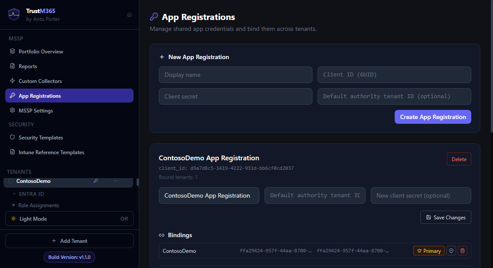

# App Registrations

## Overview
The App Registrations feature in TrustM365 allows you to manage and configure the application registrations required for TrustM365 to interact with your Microsoft 365 tenant. This includes setting up permissions, rotating credentials, and ensuring secure access.

## Key Features
- **View App Registrations**: See all app registrations associated with your tenant.
- **Add New App Registration**: Create a new app registration directly from the platform.
- **Credential Rotation**: Rotate secrets or certificates securely without disrupting functionality.
- **Permission Management**: Ensure the app registration has the correct permissions for TrustM365 features.

## How to Use

### Accessing App Registrations
1. Navigate to **MSSP Settings** in the sidebar.
2. Select **App Registrations** from the dropdown menu.

### Viewing Existing App Registrations
- The page displays a list of all app registrations, including their names, client IDs, and status.
- Click on an app registration to view detailed information, including permissions and expiration dates.

### Adding a New App Registration
1. Click the **Add App Registration** button.
2. Fill in the required fields:
   - **Name**: A descriptive name for the app registration.
   - **Permissions**: Select the necessary permissions for the app.
   - **Redirect URI**: Specify the redirect URI for authentication.
3. Click **Save** to create the app registration.

### Rotating Credentials
1. Select the app registration you want to update.
2. Click **Rotate Credentials**.
3. Choose to generate a new secret or upload a new certificate.
4. Confirm the rotation and update any dependent services with the new credentials.

### Managing Permissions
- Use the **Permissions** tab to view and update the permissions granted to the app registration.
- Ensure all required permissions are granted to avoid functionality issues.

## Best Practices
- Regularly rotate credentials to enhance security.
- Review permissions periodically to ensure compliance with the principle of least privilege.
- Use descriptive names for app registrations to make management easier.

## Troubleshooting
- **Missing Permissions**: If a feature is not working, check the permissions tab to ensure all required permissions are granted.
- **Credential Expiry**: Monitor the expiration dates of secrets and certificates to avoid service disruptions.

## Related Guides
- [17 — Credential Rotation](17-credential-rotation.md)
- [05 — The Dashboard](05-the-dashboard.md)

## Visual Reference
