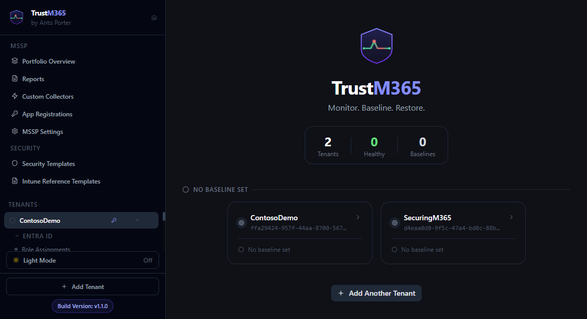
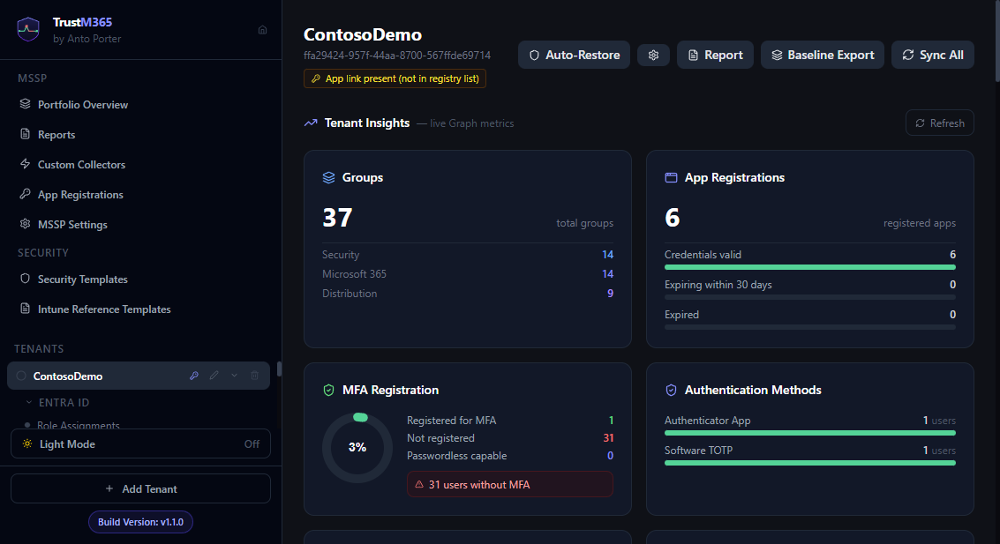
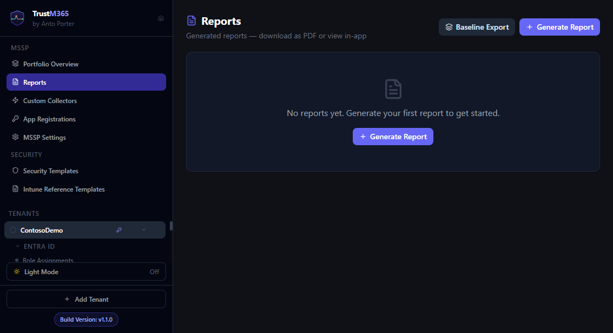

# TrustM365 Feature Guides

Step-by-step documentation for every component of TrustM365.

> Documentation in this folder is aligned to TrustM365 v1.1.0.

## Visual Quick Reference

These screenshots are intentionally lightweight and map to the main walkthrough guides for visual learners.

| Screen | Related guide |
|---|---|
|  | [01 — Registering a tenant](01-registering-a-tenant.md) |
|  | [05 — The Dashboard](05-the-dashboard.md) |
|  | [06 — Area View](06-area-view.md) |
|  | [09 — Portfolio Overview](09-portfolio-overview.md) |
|  | [10 — Generating reports](10-generating-reports.md) |
|  | [15 — Custom Collectors](15-custom-collectors.md) |

More visual references are embedded directly inside the remaining guides, including baseline editing, restore logging, security templates, app registrations, and MSSP settings workflows.

| Guide | Description |
|---|---|
| [01 — Registering a tenant](01-registering-a-tenant.md) | Connect TrustM365 to a Microsoft 365 tenant |
| [02 — Configuring a baseline](02-configuring-a-baseline.md) | Define the intended state and start monitoring |
| [03 — Understanding drift detection](03-understanding-drift-detection.md) | How drift is detected, surfaced, and categorised |
| [04 — Restoring to baseline](04-restoring-to-baseline.md) | Per-property, full resource, bulk, auto-restore, and dry-run |
| [05 — The Dashboard](05-the-dashboard.md) | Tenant dashboard, sync, settings (Drift / App Registration), auto-restore |
| [06 — Area View](06-area-view.md) | Resource-level diff view, restore log, baseline history |
| [07 — Tenant Insights](07-tenant-insights.md) | MFA registration, auth methods, devices, guest ratio (requires AuditLog.Read.All + Entra P1/P2) |
| [08 — Search and filtering](08-search-and-filtering.md) | Local page filters — Portfolio, Area View, Baseline Editor, Reports |
| [09 — Portfolio Overview](09-portfolio-overview.md) | Cross-tenant Scorecard and Matrix views |
| [10 — Generating reports](10-generating-reports.md) | Tenant reports — HTML viewer, PDF, and Word (.docx) export |
| [11 — Report scheduling](11-report-scheduling.md) | Automated weekly and monthly report generation |
| [12 — Webhook notifications](12-webhook-notifications.md) | Drift alerts to Teams, Slack, PagerDuty, or any HTTP endpoint |
| [13 — White-labelling](13-white-labelling.md) | Company branding, logo, colours, and report accent for client-facing output |
| [14 — Security Templates](14-security-templates.md) | Security posture checks (Zero Trust Assessment V2) |
| [15 — Custom Collectors](15-custom-collectors.md) | Monitor any Graph endpoint without code |
| [16 — Intune endpoint security](16-intune-endpoint-security.md) | Compliance, Update Rings, MTD, App Protection, Antivirus, Firewall, BitLocker, ASR |
| [17 — Credential rotation](17-credential-rotation.md) | Updating an App Registration secret without data loss |
| [18 — Troubleshooting](18-troubleshooting.md) | Common problems and how to fix them |
| [19 — App Registrations](19-app-registrations.md) | App registration management, bindings, and permission refresh |
| [20 — Reference Templates](20-reference-templates.md) | Policy comparison workflow (single-tenant only as of v1.1); experimental features and tenant-level result analysis |
| [21 — Log Analytics and Sentinel](21-log-analytics-and-sentinel.md) | Configure direct ingestion, validate tables, deploy Sentinel rules, and import workbook assets |
| [22 — Sentinel content pack operations](22-sentinel-content-pack-operations.md) | Validate, deploy, tune, and maintain TrustM365 Sentinel artifacts over time |
